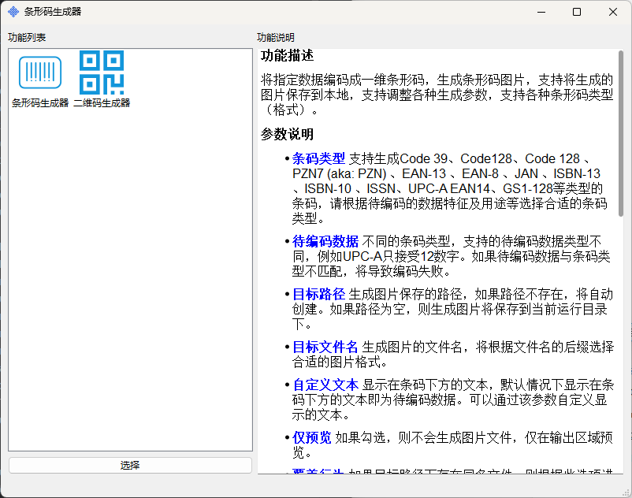
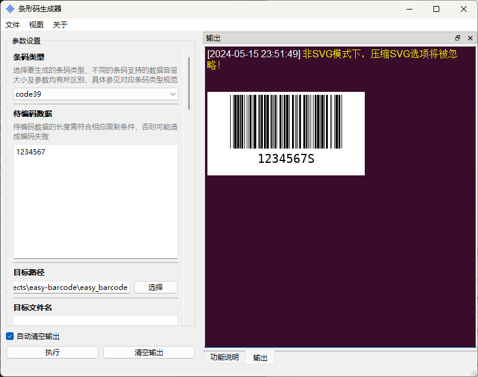
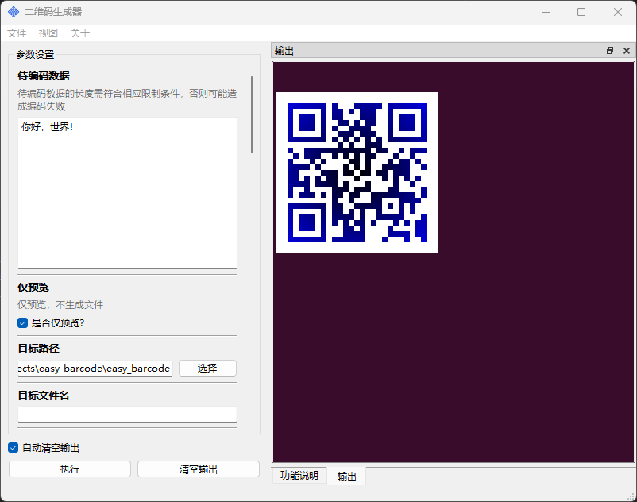

# 简易条码生成器

---

## 一、概览

一个简单易用的条形码生成器，具有以下特性：

- 支持多种条形码类型，包括一维条形码和二维码，支持多种条码标准，如：EAN-13、EAN-8、UPC-A、UPC-E、Code 128、Code 39等
- 支持丰富的调整参数，用以控制生成条码的质量、外观（如颜色、大小、边距等）
- 支持导入、导出生成参数为配置文件，方便用户分享和快速调整
- 支持批量生成功能
- 提供简单的图形界面，方便用户调整参数

## 二、用户界面

## 三、许可协议

本应用基于GPL V3.0协议开源，您可以免费使用、修改、分发本应用，请遵守GPL V3.0协议相关条款。

## 四、致谢

本应用使用开源项目：
- [python-barcode](https://github.com/WhyNotHugo/python-barcode) 用于一维条码的生成
- [qrcode](https://github.com/lincolnloop/python-qrcode) 用于二维码的生成
- [PyGUIAdapter](https://github.com/zimolab/PyGUIAdapter) 用于生成用户界面，从某种程度上讲，本应用目的之一就是为了演示pyguiadapter的使用及其各方面特性

感谢以上及其他未列明的开源项目。