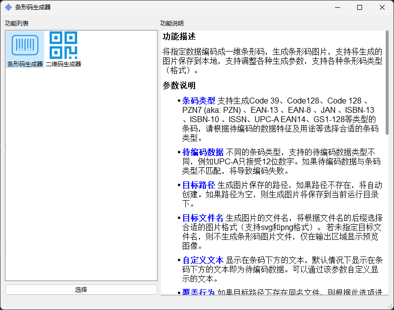

# 简易条码生成器

---


## 一、功能

这是一个用于生成条形码和二维码的图形界面工具。它支持以下特性：

- 支持生成一维条形码和二维码。
- 支持将生成的条形码和二维码保存为图片文件。
- 条形码支持多种格式，如：EAN-13、EAN-8、UPC-A、UPC-E、Code 128、Code 39等。
- 二维码支持中文字符。
- 支持丰富的调节参数。例如，条形码可以调整分辨率、条块尺寸、左右边距、自定义文字、背景色、前景色等；二维码支持调二维码大小、纠错级别（容错率）、码元大小、
同时也支持调整码元形状、背景颜色（支持渐变色）、背景图片、嵌入logo等参数以生成风格化的二维码。
- 支持导入导出参数为配置文件，方便一次配置快速生成或者与他人共享生成参数。
- 支持批量生成功能，可以为特定数据集生成条码、二维码。（暂未实现）

## 二、用户界面



## 三、许可协议

本应用基于GPL V3.0协议开源，您可以免费使用、修改、分发本应用，请遵守GPL V3.0协议相关条款。


## 三、安装

本应用基于python3.12开发，使用poetry作为包管理工具，可以克隆本仓库，使用poetry安装依赖，然后运行main.py文件。

1、克隆本仓库：
```bash
git clone https://github.com/zimolab/easy-barcode.git
```

2、安装依赖（假设你已经安装python3.12和poetry）：
```bash
cd easy-barcode
poetry install
```

3、运行应用（如使用虚拟环境，则需要先激活虚拟环境）：
```bash
python main.py
```

当然，也可以使用pyinstaller将本应用打包为单个可执行文件。

[easy-barcode_win.spec](easy-barcode_win.spec) 文件是为windows编写的打包配置文件，使用以下命令打包可执行文件：

```bash
pyinstaller .\easy-barcode_win.spec --clean
```

实测生成的可执行文件大小在40M左右。

如果只是想要使用本应用，也可以前往release下载预先打包好的可执行文件，目前仅预先打包了windows版本的可执行文件。

其他平台的打包配置文件请参考[easy-barcode_win.spec](easy-barcode_win.spec)，应当非常容易。


## 四、致谢

本应用使用开源项目：
- [python-barcode](https://github.com/WhyNotHugo/python-barcode) 用于一维条码的生成
- [qrcode](https://github.com/lincolnloop/python-qrcode) 用于二维码的生成
- [PyGUIAdapter](https://github.com/zimolab/PyGUIAdapter) 用于构建用户界面

感谢以上及其他未列明的开源项目。